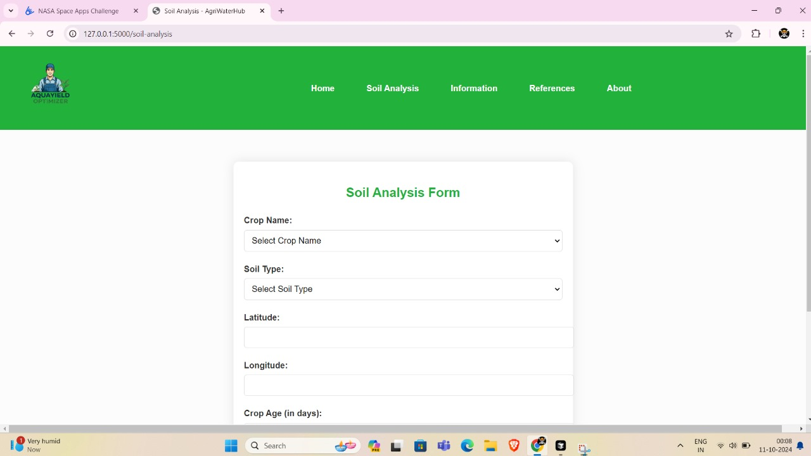
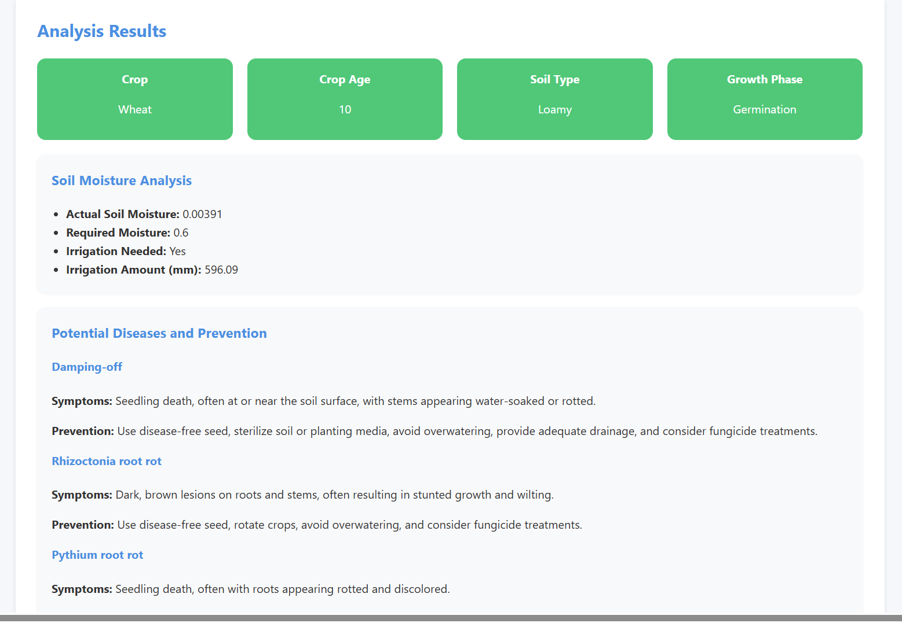

# Website is live
<link href="https://nasa-space-apps-challenge-2024-2.onrender.com">Aqua Field Optimizer</link>

# AquaYield Optimizer  
**Leveraging Earth Observation Data for Informed Agricultural Decision-Making**

## Project Objective  
The *AquaYield Optimizer* is an advanced decision-making tool designed to assist farmers in optimizing water usage through the integration of real-time satellite data and weather forecasts. By leveraging NASA's SMAP satellite data and Meteomatics NASA API weather predictions, this platform helps farmers manage irrigation and crop health, ultimately improving agricultural efficiency, sustainability, and crop yield.


## Farmer Journey: Gangaram's Success with AquaYield Optimizer


Meet **Gangaram**, a hardworking farmer from Maharashtra. He has been cultivating *wheat* for years, but unpredictable rainfall and rising water costs have made farming a challenge. Like many farmers, Gangaram often found it difficult to decide when and how much to irrigate his fields. Sometimes he would over-water his crops, wasting precious resources, and other times he would under-water them, affecting the yield. But things changed when Gangaram discovered **AquaYield Optimizer**, a tool that uses cutting-edge NASA satellite data and weather forecasting to guide him through his farming journey.

### Day 1: Getting Started with AquaYield Optimizer

One morning, Gangaram heard from a fellow farmer about this incredible solution that helps manage water more efficiently using satellite data. Curious, he signed up and entered his crop details into AquaYield Optimizer:

- **Crop:** Wheat
- **Soil Type:** Loamy soil
- **Growth Phase:** Vegetative

Within moments, the platform pulled real-time **soil moisture data** from NASA’s **SMAP satellite** and **weather forecasts** from the Meteomatics API. Based on this information, AquaYield Optimizer instantly calculated the water needs of Gangaram's wheat field.

### Day 2: Smart Irrigation Advice

A few days later, Gangaram received an alert from AquaYield Optimizer. Rain was forecasted in his area in the next 48 hours. Instead of irrigating his field as usual, the platform suggested waiting for the rain. Gangaram was relieved, knowing that this advice would save him water and money.

Sure enough, it rained two days later, just as predicted. AquaYield Optimizer reassessed the soil moisture after the rain and sent Gangaram a new irrigation plan, reducing water usage without compromising the health of his wheat crop.

### Week 3: Monitoring Crop Health

As the weeks passed, Gangaram regularly checked AquaYield Optimizer for updates. One day, he received a notification warning him of potential disease risks based on weather patterns and satellite observations. The platform suggested preventive measures and recommended steps to protect his wheat from fungal infections, which are common in the monsoon season.

Gangaram acted quickly, applying the suggested treatments. His wheat remained healthy, and he didn’t lose any crops to disease, something that had happened to him many times before.

### Harvest Time: A Bountiful Yield

Months later, it was time for the wheat harvest. Thanks to AquaYield Optimizer, Gangaram had managed his irrigation perfectly—neither wasting water nor leaving his crops thirsty. His wheat crop was healthy, and he saw a noticeable increase in his yield compared to previous years.

Not only had he saved water, but Gangaram also spent less on costly pesticides and fertilizers because the platform helped him use the right amount at the right time.

### The Impact

Gangaram couldn't stop talking about AquaYield Optimizer to his fellow farmers. For him, it wasn’t just about saving water; it was about **empowerment**—the power to make data-driven decisions and take control of his farm’s future. AquaYield Optimizer had transformed the way he farmed, improving his yield, reducing his costs, and giving him peace of mind.

---

### Why AquaYield Optimizer Worked for Gangaram:
- **Real-Time Insights:** Gangaram received up-to-date soil moisture data and precise weather forecasts, allowing him to make informed decisions.
- **Water Conservation:** He saved water by following tailored irrigation recommendations that considered both current soil conditions and upcoming rainfall.
- **Crop Health Monitoring:** AquaYield Optimizer detected potential risks and offered preventive solutions before any damage could occur.
- **Increased Yield:** By managing water and crop health more effectively, Gangaram was able to produce a more abundant harvest.

---

Gangaram’s success story is just one example of how AquaYield Optimizer is revolutionizing agriculture by helping farmers make smarter, data-driven decisions. Just like Gangaram, farmers all over the world can use this platform to improve their yields, conserve water, and protect their crops—ensuring a brighter future for agriculture.


## How It Works  


1. **Data Collection:**
   - Soil moisture data is collected from NASA's SMAP satellite.
   - Weather forecasting, including rainfall predictions, is sourced from the Meteomatics NASA API.
   - Farmers provide additional input, including crop type, soil type, and the crop's current growth phase.

2. **Data Processing:**
   - The platform combines the collected data and processes it to calculate the current and projected soil moisture levels, irrigation needs, and expected precipitation impact.
   
3. **Irrigation Recommendations:**
   - Based on soil moisture, weather forecasts, and the crop’s growth phase, the tool generates tailored irrigation recommendations.
   - If rain is expected within 2-3 days, the system advises delaying irrigation to conserve water. If no rain is forecasted for 15-20 days, it suggests optimal irrigation amounts.

4. **Crop Health Monitoring:**
   - The system continuously monitors crop health using data from the satellite and generative AI for disease prediction.
   - It provides recommendations for disease prevention and water management to keep crops healthy.

5. **Decision Power:**
   - Farmers receive clear, actionable insights on when to irrigate, how much water is needed, and the impact of upcoming weather conditions.

## Key Features  
- **Soil Moisture Data:** Leverages NASA SMAP satellite to access the latest soil moisture data for accurate analysis.
- **Weather Forecasting:** Integrates with Meteomatics NASA API to provide accurate, localized weather predictions.
- **Tailored Irrigation Suggestions:** Provides crop-specific irrigation guidance based on real-time data.
- **Crop Health Monitoring:** Uses AI to detect and predict potential diseases and other risks to crop health.
- **Water Management Optimization:** Helps farmers minimize water waste and ensures crops receive the correct amount of moisture.

## Advantages  
- **Efficient Water Use:** Prevents over-irrigation and water waste, helping farmers save water and cut costs.
- **Sustainable Farming Practices:** Promotes sustainable farming by optimizing water resources and reducing the risk of crop failure due to drought or poor water management.
- **Real-Time Insights:** Provides farmers with timely, data-driven insights to make informed decisions.
- **Scalable Solution:** The platform can be applied to farms of any size and various crops, making it adaptable to different agricultural needs.

## Future Aspects  
- **Expanded Data Sources:** In the future, we aim to integrate additional satellite and weather data sources to improve the accuracy and granularity of our predictions.
- **Advanced AI Algorithms:** Further development of AI-driven crop health monitoring and disease detection to provide more accurate and predictive insights.
- **Global Reach:** The platform can be expanded to work globally, providing valuable data to farmers in different regions.
- **Automated Irrigation Systems:** Integration with automated irrigation systems for fully autonomous water management based on our platform’s recommendations.

## Use Cases  
- **Farmers:** The primary users, who will benefit from optimized water management, increased yield, and improved crop health.
- **Agronomists:** Can use the platform to advise farmers based on the data-driven insights provided.
- **Water Management Authorities:** Can use the platform to manage water distribution more effectively at regional levels.
- **Climate Researchers:** The collected data can also be used to monitor and study the effects of climate change on agriculture.

## How the Calculations Are Done  
1. **Soil Moisture Calculation:**
   - We obtain real-time soil moisture data from NASA’s SMAP satellite. This data reflects the current water content in the soil.
   - A constant infiltration rate of 50% is assumed when estimating moisture changes due to precipitation.
   - The formula used is:
     \[
     \text{Updated Soil Moisture} = \text{Current Soil Moisture} + (\text{Precipitation} \times 0.50)
     \]
   - The optimal moisture level for each crop is maintained by checking if the soil moisture exceeds or falls below the threshold, after accounting for precipitation.

2. **Irrigation Need Calculation:**
   - The tool calculates how much additional water is required to maintain optimal soil moisture for the crop.
   - The equation for irrigation needs:
     \[
     \text{Irrigation Required} = \text{Optimal Moisture Level} - \text{Current Soil Moisture} - \text{Expected Precipitation}
     \]
   - If the expected precipitation is sufficient, irrigation is not recommended, and the system advises waiting for rainfall.

3. **Precipitation Impact:**
   - The tool factors in forecasted rainfall over the next 2-3 days to adjust irrigation recommendations. If rain is expected, it reduces the irrigation amount accordingly.

## Technologies Used  
- **NASA SMAP Satellite Data** for soil moisture analysis.
- **Meteomatics NASA API** for weather forecasting and precipitation data.
- **Machine Learning** and **AI algorithms** for disease detection and crop health monitoring.
- **Python** for data processing, integration, and calculations.
- **Web Technologies** for creating a user-friendly interface.

## How It Was Built  
1. **Data Gathering:** Data was gathered from NASA SMAP and Meteomatics NASA API.
2. **Backend Processing:** Using Python, algorithms were developed to process the soil moisture, precipitation, and farmer-provided data.
3. **AI Integration:** AI models were integrated for predictive disease monitoring.
4. **Frontend Development:** A simple, intuitive interface was built using web technologies to make the tool accessible for farmers.

## Conclusion  
*AquaYield Optimizer* is a powerful, data-driven solution that empowers farmers to make smarter decisions about water management and crop health. By leveraging cutting-edge satellite data and weather forecasting, the platform helps mitigate the effects of unpredictable weather and optimizes the use of precious water resources in agriculture.


## How to Run on Your Local Environment

Follow the steps below to set up and run *AquaYield Optimizer* locally:

### 1. Clone the Repository  
First, clone the repository to your local machine using the following command:
```bash
git clone https://github.com//AquaYield_Optimizer.git
```

### 2. Set Up the Environment  
To ensure that the application runs smoothly, you’ll need to set up a Python virtual environment and install the necessary dependencies.

#### For Windows:
```bash
python -m venv env
.\env\Scripts\activate
```

#### For macOS/Linux:
```bash
python3 -m venv env
source env/bin/activate
```

### 3. Install Required Dependencies  
Navigate to the project directory and install the necessary Python libraries using the `requirements.txt` file:
```bash
pip install -r requirements.txt
```

### 4. Set Up API Keys  
You’ll need access to NASA’s SMAP data and the Meteomatics NASA API. Obtain your API keys and add them to a `.env` file in the root of the project with the following content:
```
NASA_SMAP_API_KEY=your_nasa_api_key
METEOMATICS_API_KEY=your_meteomatics_api_key
```

### 5. Run the Application  
Once the dependencies are installed and API keys are set, you can run the project. Depending on the framework used, use one of the following commands:

#### For Flask :
```bash
flask run
```


### 6. Access the Application  
After running the server, open your web browser and navigate to:
```
http://localhost:5000 

```

You should now see the *AquaYield Optimizer* interface.

---

### Notes:
- Ensure that you have a stable internet connection for API calls to NASA's SMAP satellite data and Meteomatics weather data.
- For better performance, you may want to set up a caching mechanism for the API responses.

### 7. Testing the Platform  
You can test the platform by providing mock input data (such as crop type, soil type, and growth phase) and observe the water management recommendations and crop health insights.

-
